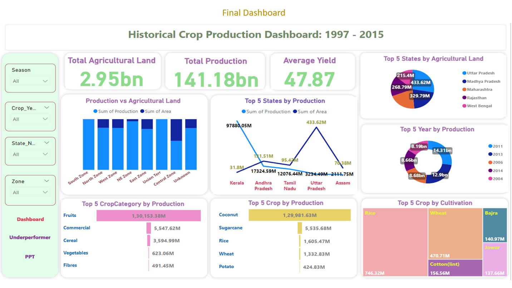

## Crop Production in India (1997-2015)
This repository contains data and analyses related to crop production in India from 1997 to 2015. The dataset includes information on production across various states and districts, categorized by crop type, season, and area

## Dataset
The dataset consists of the following columns:

state_name: Name of the state
district_name: Name of the district
crop_year: Year of crop production
season: Season of crop production (e.g., Kharif, Rabi, etc.)
crop_name: Name of the crop
production: Production quantity of the crop
area: Area of cultivation

## Data Cleaning
The data was cleaned using Microsoft Excel to ensure consistency and remove any anomalies. The cleaned dataset is available in the data folder.

## SQL Analysis
SQL queries were run to extract insights and perform various analyses on the dataset. The SQL scripts used for these analyses can be found in the sql folder.

## Power BI Visualization
The data was visualized using Power BI, leveraging DAX for advanced calculations and insights. The Power BI file (.pbix) and relevant screenshots are available in the visualizations folder.

## PowerPoint Presentation
A PowerPoint presentation explaining the visualizations and insights derived from the data is included in the presentation folder

## How to Use
1. Data Cleaning: The cleaned dataset is provided in the data folder. It can be used directly for further analysis.
2. SQL Queries: Run the SQL scripts in the sql folder to extract insights from the dataset.
3. Power BI Visualization: Open the Power BI file in the visualizations folder to explore the visualized data and insights.
4. Presentation: Review the PowerPoint presentation in the presentation folder for an overview of the visualizations and findings.

## Dashboard Demo 

